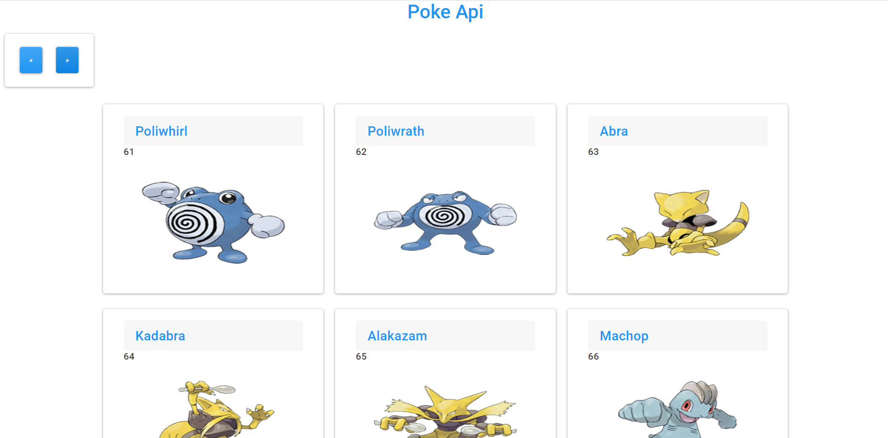

# Pokédex
Este proyecto es una api de Pokémon, que consiste en una pokédex donde puedes encontrar todos los pokemons.

## Tecnologías que he utilizado 🛠️

>Mi api esta creada con HTML5 , CSS3,Layout( Flex ),Bootstrap, Responsive Design,
JavaScript,Axios, Fetch,Node, Express, Sequelize y Mysql Workbench.

 ---

#### Preview

 


---

### Instalación 🔧

Para poder iniciar el proyecto primero haz un clone:

```
git clone https://github.com/SofiaPinilla/pok-dex.git
```
Una vez clonado el proyecto, debes instalar los modulos necesarios con npm:
```
npm i express sequelize mysql2
```

Ya esta listo el proyecto, ahora para iniciarlo debes levantar el backend con node:
```
cd backend
```
```
node app
```

Y levantar el frontend con live server o iniciar tu index.html.

---
Hecho por [Sofía Pinilla](https://github.com/SofiaPinilla) 😊
